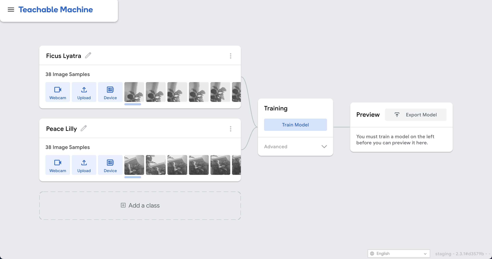
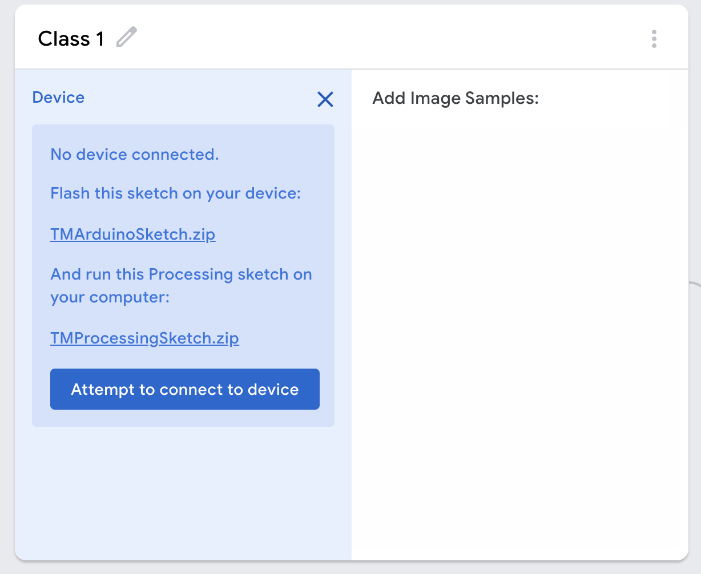
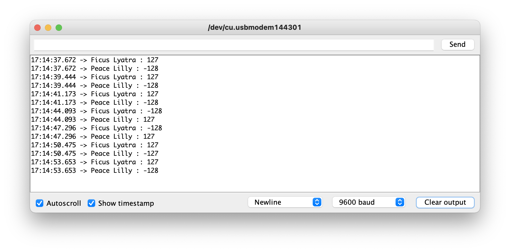
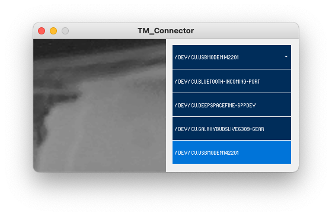
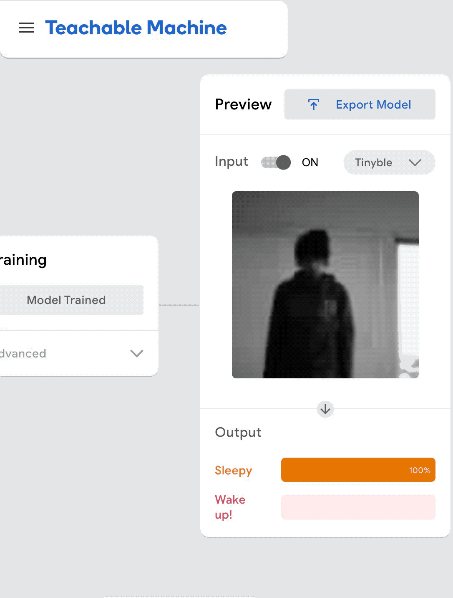

# Desafio IoT: Projeto de Sensores Inteligentes para IoT
## Evolução da Detecção de Objetos e TinyML

Este desafio apresentou mais dois desafios a url citada não mais existe e o doc de descrição também não abre, ai restou apresentar o trabalho de outra forma.
O assunto e interessantissimo e a evolução no mesmo é contínua. 
Então resolvemos mudar um pouco a exposição e nos aprofundar com uma pesquisa sobre o que a de "novo" sobre este assunto.

O modelo **YOLOv3** mencionado nas fontes foi treinado para detectar e reconhecer um total de **80 objetos diferentes**.

Embora as fontes não apresentem a lista completa e detalhada dos 80 itens, elas fornecem algumas informações contextuais sobre seu uso:

*   **Detecção em Tráfego:** O modelo é demonstrado em um vídeo de exemplo chamado "traffic-mini.mp4", sugerindo sua capacidade de reconhecer elementos comuns em vias públicas.
*   **Aplicações Gerais:** Ele é utilizado para detectar, localizar e reconhecer objetos visualmente observáveis em imagens, vídeos e transmissões de câmeras em tempo real (como webcams ou câmeras IP).
*   **Resultados Visuais:** Quando o modelo é executado, ele gera caixas delimitadoras ao redor dos objetos detectados, exibindo o **nome do objeto** e a **probabilidade de reconhecimento** em porcentagem.

Para casos onde se deseja reconhecer objetos específicos que não fazem parte desses 80 originais (como os exemplos de "Ficus Lyatra", "Peace Lilly" ou maturação de bananas citados anteriormente), as fontes sugerem o uso de ferramentas como o **Teachable Machine**, que permitem treinar modelos personalizados.

Você pode encontrar os links para baixar o **TMUploader** e o **TMConnector** diretamente na interface do site **Teachable Machine**, ao iniciar um novo projeto de "Modelo incorporado" (Embedded Model).

Para acessá-los, siga estes passos:

1.  No site do **Teachable Machine**, crie um novo projeto de imagem e selecione a opção **"Modelo incorporado"**.
2.  Nas opções de entrada de amostras da classe, clique em **"Dispositivo"** (Device).
3.  Uma janela flutuante aparecerá com os links para download:
    *   **TMUploader:** No site, ele aparece com o nome **`TMArduinoSketch.zip`**. Você deve baixá-lo, descompactá-lo e carregá-lo em seu Arduino Nano 33 BLE usando a IDE do Arduino.
    *   **TMConnector:** No site, ele é listado como **`TMProcessingSketch.zip`**. Este arquivo deve ser aberto e executado na IDE do Processing para estabelecer a conexão entre o hardware e o navegador.

Certifique-se de que o Arduino esteja com o sketch carregado e que a porta serial correta tenha sido selecionada no Processing para que a imagem da câmera apareça corretamente.

Para exportar o seu modelo treinado do Teachable Machine para o Arduino, siga este procedimento após concluir o treinamento:

1.  **Clique em "Exportar modelo":** Este botão está localizado acima da janela de pré-visualização no site do Teachable Machine.
2.  **Selecione o formato correto:** Na janela que abrir, selecione a aba **"Tensorflow Lite"**.
3.  **Escolha a variante para hardware:** Selecione a opção **"Tensorflow Lite para Microcontroladores"** e clique no botão **"Baixar meu modelo"**.
4.  **Aguarde a conversão:** O sistema converterá seu modelo em segundo plano por alguns instantes e baixará automaticamente uma **pasta compactada (.zip)** contendo um sketch do Arduino já com o seu modelo incorporado.
5.  **Carregue no dispositivo:** Feche todos os sketches do Processing que estiverem abertos e carregue este novo sketch baixado para o seu Arduino Nano 33 BLE.
6.  **Verifique os resultados:** Após o carregamento, abra o **Monitor Serial** na IDE do Arduino. Você verá os nomes das classes que você criou (ex: "Banana Madura") sendo impressos junto com o nível de confiança da detecção.

**Observação:** Os níveis de confiança no monitor serial variam de **-128 a 127**. Se os resultados não forem os esperados, as fontes sugerem coletar mais amostras ou testar diferentes abordagens nos exemplos de treinamento.

Este projeto documenta a rápida transição da detecção de objetos de sistemas complexos baseados em PC para soluções de **TinyML** (Machine Learning em microcontroladores) que podem ser treinadas no navegador e executadas em um **Arduino Nano 33 BLE**.

## 1. A Evolução Tecnológica: Da Complexidade à Simplicidade

Até recentemente, implementar a detecção de objetos era um processo altamente técnico que exigia um sólido domínio de matemática aplicada e milhares de linhas de código. Sistemas baseados na biblioteca **ImageAI** permitiram simplificar essa tarefa, mas ainda dependiam de ambientes robustos:

*   **Requisitos Tradicionais:** Python 3.5.1+, TensorFlow, OpenCV, Keras e bibliotecas de suporte como Numpy e SciPy.
*   **Algoritmos Pesados:** Uso de modelos como **YOLOv3** (capaz de reconhecer 80 objetos diferentes) ou **RetinaNet**, que muitas vezes exigiam GPUs potentes para processamento em tempo real.
*   **Resultados:** A detecção era exibida com caixas delimitadoras e probabilidades em porcentagem em vídeos ou câmeras IP.

**Hoje**, ferramentas como o **Teachable Machine** permitem que qualquer pessoa treine modelos diretamente no navegador sem precisar programar, exportando versões reduzidas para microcontroladores.

## 2. Fluxo de Trabalho Moderna (Exemplo: Banana Madura)

Para resolver o desafio de classificar o estado de uma fruta (ex: **Banana Madura** vs. **Banana Verde**), seguimos um fluxo otimizado:

1.  **Hardware:** Conectamos uma câmera **OV7670** ao **Arduino Nano 33 BLE** usando cabos fêmea-fêmea.
2.  **Coleta de Dados:** Usando o sketch **TMUploader** no Arduino e o **TMConnector** no Processing, enviamos imagens em tempo real para o Teachable Machine.
3.  **Treinamento:** Gravamos amostras de bananas maduras e verdes no site e clicamos em "Treinar Modelo".
4.  **Exportação:** O modelo é convertido para **TensorFlow Lite para Microcontroladores** e baixado como um sketch pronto para o Arduino.

> **[INFOGRÁFICO: FLUXO DE IA EM MICROCONTROLADORES]**
>

## 3. Configuração de Hardware e Software

### Conexão dos Pinos (Câmera OV7670 para Arduino)
| OV7670 | Arduino Nano 33 BLE |
| :--- | :--- |
| 3.3V | 3.3V |
| SCL/SDA | A5 / A4 |
| VSYNC/HREF/PCLK | D8 / A1 / A0 |
| D7 a D0 | D4, D6, D5, D3, D2, RX, TX, D10 |

### Bibliotecas Necessárias
*   **Arduino IDE:** `Arduino_TensorFlowLite` (v2.4.0-ALPHA+) e `Arduino_OV767X`.
*   **Processing:** `ControlP5` e `Websockets`.

## 4. Resultados e Referências

Após carregar o modelo final no Arduino, os resultados de confiança (variando de **-128 a 127**) podem ser monitorados diretamente no **Monitor Serial** da IDE.

### Links de Referência
*   **Resultados em Vídeo (Método Tradicional):** [Detecção de Objetos com TensorFlow](https://youtu.be/xZW8j-umdgs).
*   **Artigo ImageAI:** [Detecting objects in videos and camera feeds](https://heartbeat.fritz.ai/detecting-objects-in-videos-and-camera-feeds-using-keras-opencv-and-imageai-c869fe1ebcdb).
*   **Guia TinyML:** [Getting Started with Embedded Teachable Machine](https://github.com/googlecreativelab/teachablemachine-community/blob/master/snippets/markdown/tiny_image/GettingStarted.md).

---

### Galeria de Processo

| Treinamento | Conexão de Dispositivo | Monitor Serial |
| :---: | :---: | :---: |
|  |  |  |
| *Interface de treinamento do modelo.* | *Preparação para envio de dados.* | *Confiança da detecção em tempo real.* |

---
Aqui está a atualização para o seu arquivo `readme.md`, incluindo os links de vídeo solicitados e um mini-tutorial focado no **Teachable Machine** com o exemplo prático de classificação de bananas.

---

## 5. Resultados em Vídeo

A evolução da tecnologia de detecção, saindo de modelos complexos para execuções em tempo real, pode ser visualizada nos links abaixo:

*   **Demonstração de Detecção de Objetos (TensorFlow/ImageAI):** [Assista aqui](https://youtu.be/xZW8j-umdgs) e [neste link](https://youtu.be/Q3lKlzi_cEw),.

---

## 6. Destaque: Teachable Machine (TinyML)

O **Teachable Machine** é a ferramenta central desta revolução, permitindo criar modelos de aprendizado de máquina diretamente no navegador, sem a necessidade de programação complexa. Para o nosso desafio de IoT, ele permite exportar modelos reduzidos para rodar em microcontroladores como o **Arduino Nano 33 BLE**.

Para integrar o modelo da **banana madura** (ou qualquer outra classe treinada) no seu código final, o processo é amplamente automatizado pela plataforma **Teachable Machine**, eliminando a necessidade de programar manualmente a lógica de carregamento do modelo.

Aqui estão os passos detalhados para realizar essa integração:

### 1. Exportação do Modelo
Após concluir o treinamento das suas classes (ex: "Banana Madura" e "Banana Verde"), você deve exportar o trabalho realizado no navegador para o formato compatível com o hardware:
*   Clique no botão **"Exportar modelo"** na parte superior da janela de pré-visualização.
*   Selecione a aba **"Tensorflow Lite"**.
*   Escolha a opção **"Tensorflow Lite para Microcontroladores"** e clique em **"Baixar meu modelo"**.

### 2. O Código Final
A integração acontece no momento do download. O Teachable Machine não fornece apenas o modelo, mas sim uma **pasta compactada (.zip)** que contém um **sketch completo do Arduino (.ino)**. 
*   Este sketch já possui o seu modelo de bananas incorporado e toda a estrutura de código necessária para realizar a inferência no dispositivo.
*   **Não é necessário copiar e colar código** de um lugar para outro; o arquivo baixado já é o seu código final pronto para uso.

### 3. Implementação no Hardware
Para que o modelo funcione no seu dispositivo, siga estes procedimentos:
*   Feche qualquer outro programa (como o Processing) que esteja utilizando a porta serial do Arduino.
*   Abra o sketch baixado na **IDE do Arduino** e faça o upload para o **Arduino Nano 33 BLE**.
*   Certifique-se de que as bibliotecas `Arduino_TensorFlowLite` (versão 2.4.0-ALPHA ou superior) e `Arduino_OV767X` estejam instaladas na sua IDE.

### 4. Verificação da Integração
Uma vez carregado, o modelo passará a classificar as imagens capturadas pela câmera OV7670 em tempo real. Para ver o resultado:
*   Abra o **Monitor Serial** da IDE do Arduino (configurado para **9600 baud**).
*   O console exibirá o nome da classe detectada (ex: **"Banana Madura"**) ao lado de um valor de confiança que varia de **-128 a 127**. 

Dessa forma, a "integração" é o ato de baixar o pacote de software customizado que a ferramenta gera especificamente para o seu modelo treinado.

### Mini-Tutorial: Classificação de Bananas (Madura vs. Verde)

Para resolver o desafio proposto, utilizaremos o exemplo de identificação do estado de maturação de uma banana.

#### Passo 1: Configuração do Projeto
Acesse o site do Teachable Machine e crie um novo projeto de imagem, selecionando obrigatoriamente a opção **"Modelo incorporado" (Embedded Model)** para garantir a compatibilidade com o Arduino.

#### Passo 2: Coleta de Dados (Amostras)
Crie duas classes: **"Banana Madura"** e **"Banana Verde"**.
1.  Conecte seu Arduino Nano 33 com a câmera OV7670.
2.  Use o tipo de entrada **"Dispositivo"** no Teachable Machine.
3.  Posicione a banana a cerca de 30 cm da câmera e use o botão "Gravar" para coletar diversas fotos de bananas maduras e, depois, repita para as verdes.

*Exemplo de interface de coleta de dados para diferentes classes.*

#### Passo 3: Treinamento
Clique em **"Treinar Modelo"**. O navegador processará as imagens para aprender a distinguir as cores e padrões de cada estado da fruta.

#### Passo 4: Conexão e Teste
Utilize o **TM Connector** (via Processing) para visualizar em tempo real se o modelo está identificando corretamente a banana apresentada à câmera do Arduino,.

| Seleção da Porta Serial | Teste de Confiança |
| :---: | :---: |
|  |  |
| *Escolha a porta correta no Processing.* | *O modelo exibindo a confiança da detecção.* |

#### Passo 5: Exportação para o Arduino
1. Clique em **"Exportar Modelo"** e selecione **"Tensorflow Lite para Microcontroladores"**.
2. Baixe o arquivo `.zip` que contém o sketch do Arduino já com o seu modelo de bananas incorporado.
3. Carregue o código no Arduino e abra o **Monitor Serial**. Você verá a classificação (ex: "Madura") e o nível de confiança (que varia de -128 a 127) sendo exibidos continuamente,.

*Resultados da classificação e confiança impressos no Monitor Serial.*

---
Para conectar a câmera **OV7670** ao **Arduino Nano 33 BLE** (ou BLE Sense), você deve utilizar **cabos fêmea-fêmea**. Embora a identificação dos pinos possa variar ligeiramente conforme a variante da câmera, a disposição geral segue o mapeamento abaixo:

### Tabela de Conexão de Pinos

| Pino da Câmera OV7670 | Pino do Arduino Nano 33 BLE |
| :--- | :--- |
| **3,3 V** | 3,3 V |
| **GND** | GND (qualquer pino marcado como GND) |
| **SCL / SIOC** | A5 |
| **SDA / SIOD** | A4 |
| **VS / VSYNC** | D8 |
| **HS / HREF** | A1 |
| **PCLK** | A0 |
| **MCLK / XCLK** | D9 |
| **D7** | D4 |
| **D6** | D6 |
| **D5** | D5 |
| **D4** | D3 |
| **D3** | D2 |
| **D2** | D0 / RX |
| **D1** | D1 / TX |
| **D0** | D10 |

**Observação importante:** Todos os pinos da câmera OV7670 que não foram listados na tabela acima devem ser deixados **desconectados**. Se ao finalizar a montagem você visualizar apenas uma tela cinza ou estática, recomenda-se verificar se as conexões estão firmes e ajustar o anel de foco da lente para permitir a autoexposição correta.

Para o tutorial, são necessárias duas bibliotecas específicas no ambiente de desenvolvimento do **Processing**:

*   **ControlP5**: Uma biblioteca de interface gráfica (GUI) utilizada para construir interfaces de usuário personalizadas.
*   **Websockets**: Esta biblioteca permite a criação de servidores e clientes para comunicação com o mundo externo, incluindo sites, o que é essencial para conectar o sketch do Processing ao Teachable Machine.

Para instalá-las, você deve abrir a IDE do Processing, ir ao menu **Sketch** -> **Adicionar Biblioteca** -> **Gerenciar Bibliotecas** e procurar por cada uma delas pelo nome. Além das bibliotecas, você precisará baixar e executar o sketch específico **TMConnector** para estabelecer a conexão entre o seu Arduino e a ferramenta online.

Para realizar o projeto utilizando o **Processing** para conectar seu Arduino ao **Teachable Machine**, você deve instalar as seguintes bibliotecas:

*   **ControlP5**: Uma biblioteca de interface gráfica (GUI) utilizada para construir interfaces de usuário personalizadas em aplicativos desktop.
*   **Websockets**: Esta biblioteca permite a criação de servidores e clientes de websockets, possibilitando a comunicação do sketch com o mundo externo, incluindo sites (essencial para a integração com a plataforma Teachable Machine).

### Como instalar:
1.  Abra a **IDE do Processing**.
2.  No menu superior, vá em **Sketch** -> **Adicionar Biblioteca** (Add Library) -> **Gerenciar Bibliotecas** (Manage Libraries).
3.  No Gerenciador de Contribuições (Contribution Manager), procure por cada uma das bibliotecas pelo nome e clique em **Instalar**.

Essas bibliotecas são fundamentais para que o sketch **TMConnector** funcione corretamente e estabeleça a ponte de comunicação entre o hardware (Arduino/Câmera) e a ferramenta de treinamento online.
Para instalar as bibliotecas necessárias para este projeto na IDE do Arduino, você deve seguir o procedimento de gerenciamento de bibliotecas integrado à própria ferramenta. As bibliotecas requeridas são a **Arduino_TensorFlowLite** e a **Arduino_OV767X**.

Aqui está o passo a passo detalhado:

1.  **Abrir o Gerenciador de Bibliotecas:** Na IDE do Arduino, navegue até o menu **Ferramentas** -> **Gerenciar Bibliotecas...**.
2.  **Instalar a Arduino_TensorFlowLite:**
    *   No campo de busca, procure por **Arduino_TensorFlowLite**.
    *   É fundamental selecionar a versão **2.4.0-ALPHA ou posterior** antes de clicar em **Instalar**.
3.  **Instalar a Arduino_OV767X:**
    *   Limpe o campo de busca e procure por **Arduino_OV767X**.
    *   Clique em **Instalar** para concluir a configuração do suporte à câmera.

Além dessas bibliotecas, certifique-se de que o suporte para a placa **Arduino Nano 33 BLE** esteja instalado em **Ferramentas** -> **Placas** para que você possa carregar os sketches necessários, como o **TMUploader**, que prepara o dispositivo para enviar imagens para o Teachable Machine.

## 7. Referências e Materiais de Apoio

*   **Tutorial de Início Rápido:** [Getting Started with Embedded TM](https://github.com/googlecreativelab/teachablemachine-community/blob/master/snippets/markdown/tiny_image/GettingStarted.md).
*   **Hardware Requerido:** Arduino Nano 33 BLE / Sense e Câmera OV7670,.
*   **Bibliotecas Necessárias (Arduino IDE):** `Arduino_TensorFlowLite` (v2.4.0-ALPHA) e `Arduino_OV767X`.
*   **Bibliotecas de Comunicação (Processing):** `ControlP5` e `Websockets`.

*Este documento foi criado para fins educativos, demonstrando a facilidade das tecnologias modernas de IA incorporada.*
